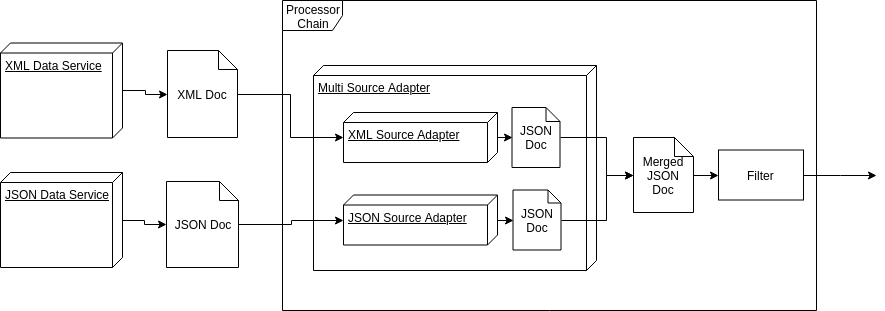

# MultiSourceAdapter
## Description
The MultiSourceAdapter allows to collect data from different sources and merge them into a single JSON object for further processing. 



## Configuration
The expected argument is an array node (`sources`) with multiple SourceAdapter definitions (`source`) and an alias (`alias`) for each of them.

Single source adapter object node example:
```
{
    "source" : {
        "name": "SomeSourceAdapter",
        "arguments" : {...} // all arguments that the specific adapter expected
    },
    "alias" : "alias to identify source later" 
}
```

Complete example:
```
"processors" : [
  {
    "name" : "MultiSourceAdapter",
    "arguments" : {
      "sources" : [
            {
                "source": {
                    "name" : "JsonSourceAdapter",
                    "arguments" : {
                        "sourceUrl" : "https://api.example.org/data/"
                    }
                },
                "alias": "sourceA"
            },
            {
                "source": {
                    "name" : "XmlSourceAdapter",
                    "arguments" : {
                        "sourceUrl" : "https://othersource.com/data/xml/"
                    }
                },
                "alias": "sourceB"
            }
        ]
    }
  }
]
```

## Result
The MultiSourceAdapter returns a JSON object which contains an array node for each source using the alias name. These array nodes include all objects a specific SourceAdapter would return.
```
{
    sourceA : [
        {someData: "from JSON source"},
        {...}
    ],
    sourceB : [
        {otherData: "from XML source"}
    ]
}
```
